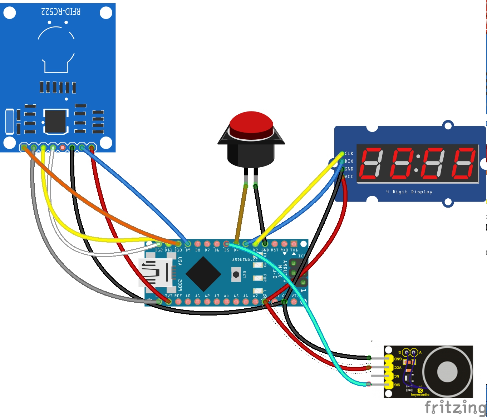

# RFID Game Demo

This demo game requires players to find the correct RFID card within a defined time frame (e.g. 15 minutes). 
A 4-digit display shows the remaining time. RFID cards are locked down in a chest, the user needs to find the key to open it. The key is attached to an magnet and it is released upon pressing a button.

## Gameplay

The player pushes a button to start the game. 

When the button is pressed, a key attached to the electromagnet drops and the countdown starts.

The player unlocks a chest containing multiple RFID cards, including one authorized card and
one penalty card. The user needs to identify the correct card and swipe it near the RFID reader.

If the player swipes the correct card, the timer will stop.
If the player swipes a penalty card, the timer will be decreased by two minutes.

Game ends when either the user swiped the correct card or the countdown expired.

## HW requirements

* Arduino Nano V3.0 (or compatible)
* Electromagnet module for Arduino
* 1x Arcade Button
* TM1637 4-Digit I2C display for Arduino
* MRFC522 RFID reader for Arduino
* 2x RFID tags

## HW connections

| Signal            | Arduino Pin   |
| ----------------- |:-------------:|
| MFRC522 RST       | D9            |
| MFRC522 SDA (SS)  | D10           |
| MFRC522 MOSI      | D11           |
| MFRC522 MISO      | D12           |
| MFRC522 SCK       | D13           |
| DISPLAY CLK       | D2            |
| DISPLAY DIO       | D3            |
| START BUTTON      | D4            |
| MAGNET SIG        | D5            |

## SW requirements

The following Arduino libraries need to be [installed](https://www.arduino.cc/en/guide/libraries) first:

* Arduino IDE - [LINK](https://www.arduino.cc/en/Main/Software)
* TimerOne Arduino Library - [LINK](http://playground.arduino.cc/Code/Timer1)
* MRFC522 Arduino Library - [LINK](https://github.com/miguelbalboa/rfid)
* TM1637 Arduino Library - [LINK](https://github.com/Seeed-Studio/Grove_4Digital_Display)